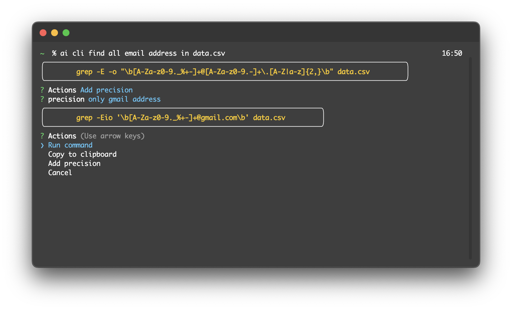

# cli-ai

CLI application that uses OpenAI ChatGPT to answer to prompts

## Usage

### Ask AI

This mode allows you to ask a question.

### Generate CLI command

This mode generates a CLI command from a prompt. You can then run this command or copy it to the clipboard.

### Conversational

Start a chat conversation with ChatGPT.

## Installation

### Manual

1. Clone this repo
2. Install dependencies `npm ci`
3. Build the project `npm run build`
4. Package the project
    - This app has only been tested on a M2 Mac and the command only exists for this architecture. `npm run package:macos`
    - If you don't have a Mac, you might need to checkout the [pkg](https://www.npmjs.com/package/pkg) documentation.
5. Add `./bin` to you path.
    - With `zsh` from this directory: `echo "\n# cli-ai\nexport PATH=\"\$PATH:$PWD/bin\"" >> ~/.zshrc`
    - With `bash` from this directory: `echo "\n# cli-ai\nexport PATH=\"\$PATH:$PWD/bin\"" >> ~/.bashrc`
6. Add your OpenAI API key with `ai config set api-key <my api key>`
